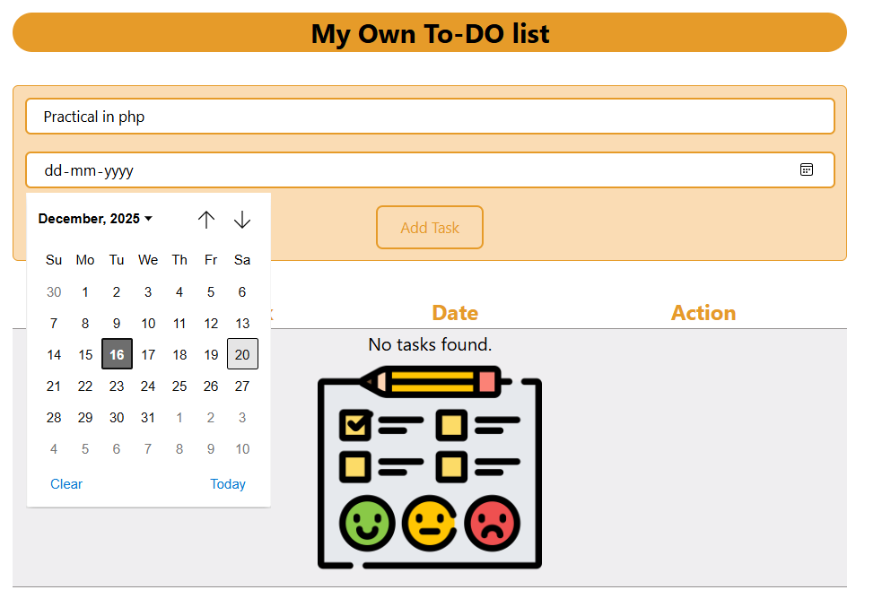
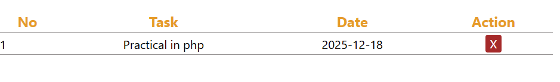

# 📝 PHP Todo List Application (XAMPP)

A simple Todo List application developed using **PHP** and **MySQL**, designed to run on **XAMPP**.  
This project helps beginners understand PHP form handling and basic database operations.

---

## 📌 Features
- Add new tasks
- Delete tasks
- Store tasks in MySQL database
- Runs locally using XAMPP
- Simple and beginner-friendly UI

---

## 🛠️ Technologies Used
- PHP
- MySQL
- HTML
- CSS
- XAMPP (Apache Server)

---

## 🖼️ Screenshots

### Run Program

### Todo List

### Result

